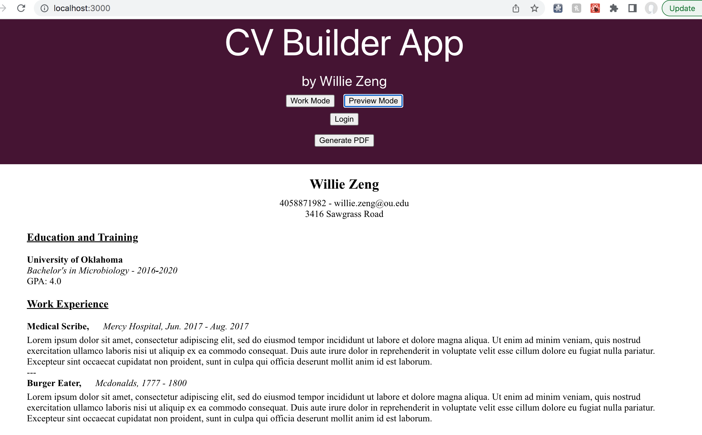

**CV Builder Application**

**This repository is a copy of my original Github repository**
Here is the link to the original repository: https://github.com/Warlyzerl/CV-application

I built this application to begin learning the ins-and-outs of React. 

The biggest takeaways I had were learning how to lift states and pass functions/state into other functional components. During this project, I attempted to useState in some of these components but began to realize the importance of keeping my state in a higher position so it is more easily accessible by other components. 

I also learned how to incorporate the html2pdf dependency into my project to turn my HTML resume template into a pdf for users to download. 

Link to Github Pages:
https://Warlyzerl.github.io/CV-builder-app

Home page:

Preview page:

Example image of a resume my App produces:

